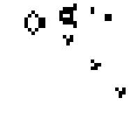
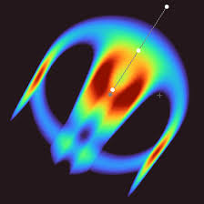

# cellular-automata

*  * 

A self-learning project combining my interests in machine learning and cellular automata, with the desire to learn JAX.

The repository contains JAX from scratch implementations of Conway's Game of Life and it's continuous extension, Lenia (src/ca/jax/)

Additionally, there is a script to train a minimal neural network (13 parameters) to learn the Game of Life update kernel from a dataset of GoL simulations. (src/ca/pytorch/train.py)

Several further directions are possible:
  - Expanding Lenia with multiple channels and kernels
  - Implementing Flow Lenia
  - Create an algorithm for automatic discovery of spatially localized patterns ("creatures"), by quantitative measurements, e.g. change in center of mass

 
